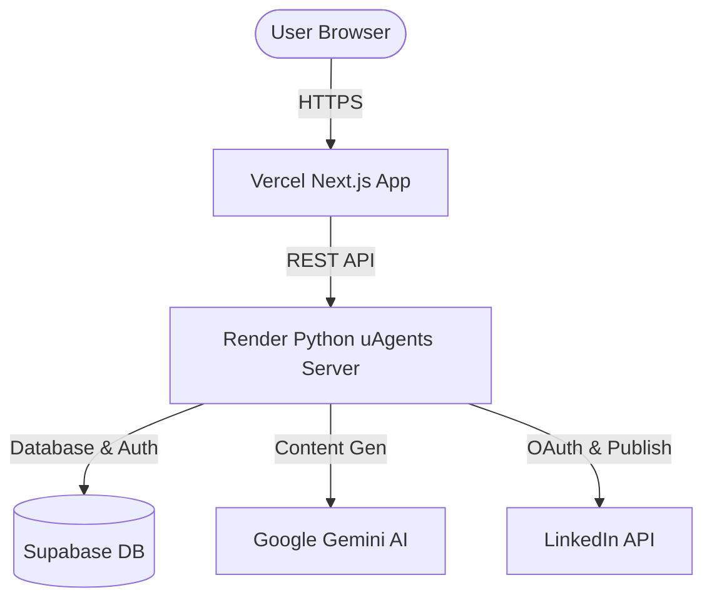

# SmartPostAI - AI-Powered Social Media Automation Platform 🚀

SmartPostAI is a full-stack, AI-powered content automation platform designed for creators, marketers, and professionals to generate, schedule, and analyze LinkedIn content effortlessly.


---

## 🌐 Live Deployments

| Component | Status | Public URL | Host |
|---|---|---|---|
| 🎨 **Frontend Web App** |  | [https://smart-post-ai-frontend.vercel.app](https://smart-post-ai-frontend.vercel.app) | **Vercel** |
| ⚙️ **Backend REST API** |  | [https://smartpost-backend.onrender.com](https://smartpost-backend.onrender.com) | **Render** |

---

## ✨ Core Features

- 🤖 **AI Post Studio**: Generate viral post hooks, engaging long-form LinkedIn content, and brand-tailored copy using Google Gemini AI.
- 🖼️ **AI Visual Generator**: Auto-generate matching images and custom SVG graphics for posts.
- 📅 **Smart Post Scheduler**: Automated scheduling queue with interval execution.
- 📊 **Analytics & Metrics**: Real-time tracking of post performance, impressions, and audience engagement.
- 🔗 **LinkedIn Integration**: Direct LinkedIn OAuth authentication and automated post publishing.
- 💡 **URL-to-Post Converter**: Convert any blog, documentation, or news article into ready-to-publish LinkedIn posts.

---

## 🏗️ Architecture Overview



---

## 🕒 Hosting & Uptime

- **Frontend (Vercel)**: **Free Forever (24/7/365)**. Global CDN, SSL security, instant deployments on `git push`.
- **Backend (Render)**: **Free Forever (24/7)**. Automatic active management (spins down after 15 minutes of inactivity and auto-wakes on first request within ~30s).

---

## 🛠️ Local Development

```bash
# Clone the repository
git clone https://github.com/Ladyunicorn560/SmartPostAI_frontend.git
cd SmartPostAI_frontend

# Install dependencies
npm install

# Start local server
npm run dev
```

---

## 📄 License

Distributed under the MIT License.
